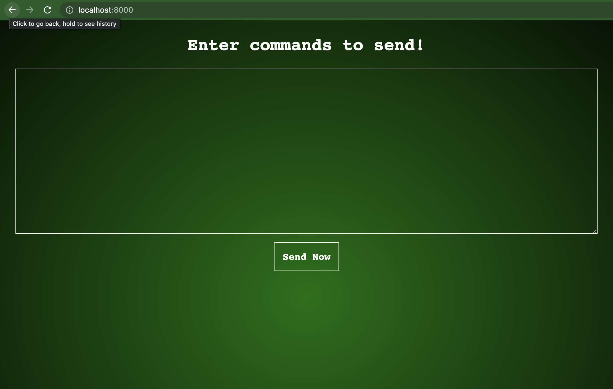
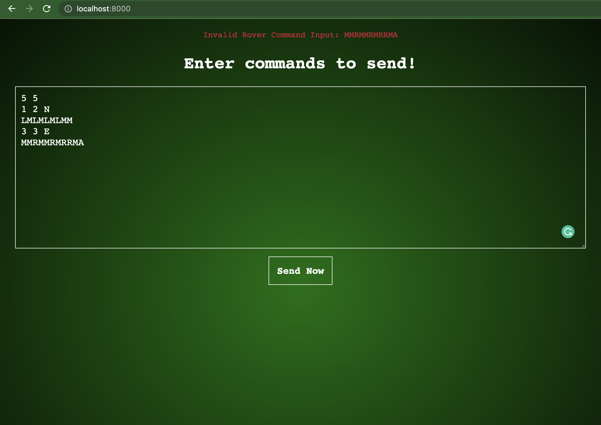
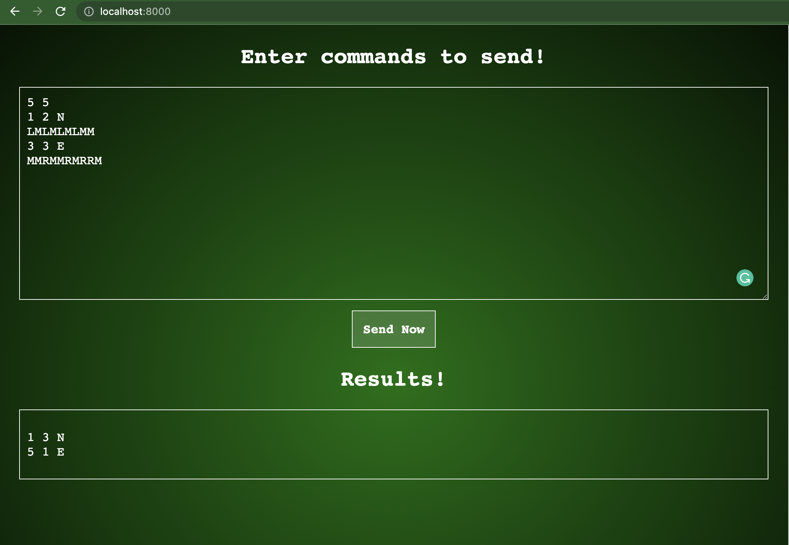

# Dolphiq Coding Challenge

##Specification
A squad of robotic rovers is to be landed by NASA on a plateau on Mars.

This plateau, which is curiously rectangular, must be navigated by the rovers so that their onboard
cameras can get a complete view of the surrounding terrain to send back to Earth.

A rover's position is represented by a combination of x and y coordinates and a letter representing one
of the four cardinal compass points. The plateau is divided up into a grid to simplify navigation. An
example position might be 0, 0, N, which means the rover is in the bottom

In order to control a rover, NASA sends a simple string of letters. The possible letters are L, R, and M. L
and R makes the rover spin 90 degrees left or right respectively, without moving from its current spot.

M means move forward one grid point and maintain the same heading.

Assume that the square directly North from (x, y) is (x, y+1).

## Prerequisites

* First, Clone the bitbucket repository.
* Then, we’ll need to download and install Docker. 
  * Head over to the Docker website, then [download and install it for your operating system](https://docs.docker.com/get-docker/).

## Configuration/Installation

Once you have everything set up, you can move on to the next section.

### Run (Local Development Server)

Then run following to boot up the servers.
```sh
$ docker-compose up
```

## Tests

Run following from the root directory of the project.

**From the Bash shell run,**
```sh
 $ ./phpunit
```

Or you can run tests directly inside the docker container
```sh
 $ docker-compose exec php php vendor/bin/phpunit
```

## Screenshots






## License
MIT